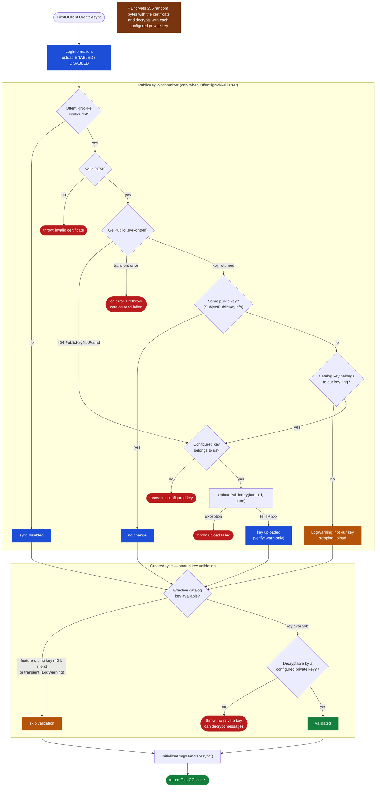

# Automatic Public Key Synchronization

## Background

Setting up a Fiks-IO account traditionally required the account's public key to be registered in the catalog manually by Fiks Forvaltning. This manual step can lead to coordination issues, especially when vendors need to rotate keys or set up accounts independently. To streamline this, we have introduced an **automatic public key synchronization** feature in the Fiks-IO .NET client.

With automatic public key synchronization, the client uploads the configured public key to the Fiks-IO catalog on startup — eliminating the need for manual coordination. The municipality employee can set up the account independently and share the account details with the vendor afterward. The first time the vendor starts their client, the key is registered automatically.

---

## Configuration

Pass the public certificate (PEM-encoded X.509) alongside the private key(s) in `KontoConfiguration`:

```csharp
// Single private key
FiksIOConfigurationBuilder
    .Init()
    .WithFiksKontoConfiguration(kontoId, privateKeyPem, publicCertPem)
    ...

// Multiple private keys (key rotation)
FiksIOConfigurationBuilder
    .Init()
    .WithFiksKontoConfiguration(kontoId, new[] { oldPrivateKeyPem, newPrivateKeyPem }, newPublicCertPem)
    ...
```

`OffentligNokkel` is optional. Omitting it disables automatic upload (no catalog write). Startup still performs best-effort key validation as described below.

---

## Is the feature enabled? (Observability)

Automatic upload is enabled **if and only if `OffentligNokkel` is configured** (non-null, non-whitespace). There are two ways to tell whether a running client has it enabled:

- **Programmatically:** `FiksIOClient.AutomaticPublicKeyUploadEnabled` (a `bool`) — useful for health checks or diagnostics.
- **In the logs:** `CreateAsync` emits one `INFO` line at startup, before any catalog interaction:
  ```
  INFO  Automatic public key upload is ENABLED for account {KontoId}.
  INFO  Automatic public key upload is DISABLED for account {KontoId}.
  ```

This removes the previous ambiguity where, at `INFO` level, a client with the feature off was indistinguishable from one with the feature on but already up to date (both were silent or `DEBUG`-only).

---

## How It Works

> **Two independent steps — don't conflate them.** Startup performs (A) optional **upload** and (B) **validation**. They are governed by different conditions:
>
> - **(A) Upload** runs **only when the feature is enabled** (`OffentligNokkel` configured / `AutomaticPublicKeyUploadEnabled == true`). This is the only step that writes to the catalog.
> - **(B) Validation** runs **regardless of the feature flag** — it is *not* gated on enable/disable. It checks that a configured private key can decrypt the catalog's public key, and runs whenever **a key exists to validate against** (an existing catalog key, or one just uploaded).
>
> Validation is skipped **only** when there is genuinely nothing to check: no key registered (404), or — for feature-off clients — the catalog is temporarily unavailable. In both of those cases the client still starts. A key that *exists but does not match* is always fatal, feature on or off.

`FiksIOClient.CreateAsync` runs `PublicKeySynchronizer.SynchronizePublicKeyAsync` before initializing the AMQP connection. The synchronizer:

1. Skips immediately if `OffentligNokkel` is not configured
2. Fetches the current public key from the catalog
3. Compares its **public key** with the configured key (`SubjectPublicKeyInfo` comparison — robust to certificate re-encoding)
4. Validates ownership before uploading (see scenarios below)
5. Uploads if needed, then proceeds with normal startup

The synchronizer distinguishes **"no key registered"** from **"catalog temporarily unavailable"**. The underlying `KS.Fiks.IO.Send.Client` throws a dedicated `FiksIOSendPublicKeyNotFoundException` on HTTP 404; any other failure (network error, 5xx, timeout) surfaces as a different exception. "Not found" means the catalog is reachable and the slot is empty (safe to upload); a transient error means the registration state is unknown (the synchronizer does **not** blind-upload over a possibly-existing key — it propagates the error).

After synchronization — **and independently of whether the upload feature is enabled** — `CreateAsync` validates the effective catalog key against the configured private keys:

- **Definite mismatch** — the catalog returned a key that none of the configured private keys can decrypt → `CreateAsync` throws `InvalidOperationException` and the client does not start. This is a guaranteed "cannot decrypt incoming messages" misconfiguration and is fatal **for all clients**, whether or not the upload feature is used.
- **No key registered** (`FiksIOSendPublicKeyNotFoundException`) — nothing to validate → startup proceeds.
- **Catalog temporarily unavailable** — for clients **not** using the upload feature, validation cannot be performed; the client logs a warning and starts (preserving pre-feature availability — a transient catalog outage must not block startup). For clients **using** the upload feature, a transient catalog error during synchronization is fatal, because the upload is an active operation that could not be completed safely.

---

## Flow Diagram



---

## Scenarios

### Scenario 1 — First-time setup: no key in catalog

**Precondition:** A new account has been created. No public key has been registered yet.

**Flow:**
1. Catalog responds 404 → `GetPublicKey` throws `FiksIOSendPublicKeyNotFoundException`, which the synchronizer interprets as "no key registered"
2. Synchronizer validates that `OffentligNokkel` matches one of the configured private keys — confirms the vendor owns the key
3. Uploads `OffentligNokkel` to the catalog
4. Client starts normally

**Result:** Key is registered. Subsequent senders will encrypt messages using this key.

**Logs:**
```
INFO  Uploading public key for account {KontoId}.
INFO  Public key uploaded for account {KontoId}.
```

---

### Scenario 2 — Key already current

**Precondition:** The public key in the catalog is identical to `OffentligNokkel`.

**Flow:**
1. Catalog returns the existing certificate
2. `SubjectPublicKeyInfo` comparison shows the public keys are identical (even if the certificate wrapper differs)
3. No upload needed

**Result:** Nothing happens. Startup proceeds immediately.

**Logs:**
```
DEBUG Public key for account {KontoId} is already up to date, skipping upload.
```

---

### Scenario 3 — Key rotation: replacing our own old key

**Precondition:** The catalog has an existing public key that belongs to the vendor's key ring (the matching private key is still configured). The vendor has generated a new key pair and wants to rotate.

**Configuration:**
```csharp
.WithFiksKontoConfiguration(
    kontoId,
    privateKeys: new[] { oldPrivateKeyPem, newPrivateKeyPem },
    offentligNokkel: newPublicCertPem)
```

**Flow:**
1. Catalog returns the old certificate
2. Keys differ → upload candidate
3. Synchronizer validates the **catalog cert** against the private key ring → `oldPrivateKeyPem` matches → rotation authorized
4. Synchronizer validates `OffentligNokkel` against the private key ring → `newPrivateKeyPem` matches → new key is ours
5. Uploads the new public certificate

**Message decryption during rotation:**

Messages already on the queue were encrypted with the old public key. The AMQP consumer tries each private key in order until one succeeds:

```
Old message arrives (encrypted with oldPubCert)
  → try newPrivateKey → fails
  → try oldPrivateKey → succeeds ✅

New message arrives (encrypted with newPubCert)
  → try newPrivateKey → succeeds ✅
```

**When is it safe to remove the old private key?**

When you are confident the queue no longer contains messages encrypted with the old key. There is no built-in indicator for this — it is an operational decision. A conservative approach is to wait 24–48 hours after rotation before removing the old key from the configuration.

**Logs:**
```
INFO  Uploading public key for account {KontoId}.
INFO  Public key uploaded for account {KontoId}.
```

---

### Scenario 4 — Catalog has an unrelated key

**Precondition:** The catalog contains a public key that does not match any of the vendor's private keys. This would occur if the account was set up by someone else (e.g., the municipality uploaded a key manually).

**Flow:**
1. Catalog returns a certificate
2. Public keys differ → upload candidate
3. Synchronizer validates the **catalog cert** against the private key ring → no match → rotation not authorized
4. Upload skipped
5. `CreateAsync` validates the catalog cert against the private key ring → no match → **throws `InvalidOperationException`**

**Result:** The client does not start. Messages in the queue are encrypted with a key the client cannot decrypt. The operator must either configure the matching private key or manually replace the catalog key.

**Logs:**
```
WARN  No configured private key matched the certificate for account {KontoId}.
WARN  Catalog public key for account {KontoId} does not belong to this client's key ring. Skipping upload.
ERROR [InvalidOperationException] No configured private key can decrypt messages for account {KontoId}.
```

---

### Scenario 5 — Misconfigured public key

**Precondition:** `OffentligNokkel` is set, but the certificate does not correspond to any of the configured private keys (e.g., wrong file was used).

**Flow:**
1. Catalog responds 404 (no existing key)
2. Synchronizer validates `OffentligNokkel` against the private key ring → no match
3. **Throws `InvalidOperationException`**

**Result:** The client does not start. The exception message clearly identifies the misconfiguration.

**Logs:**
```
WARN  No configured private key matched the certificate for account {KontoId}.
ERROR [InvalidOperationException] Configured public key for account {KontoId} does not match any configured private key.
```

---

### Scenario 6 — Catalog unavailable at startup (upload feature enabled)

**Precondition:** `OffentligNokkel` is configured and the Fiks-IO catalog API is temporarily unreachable (network issue, 5xx, timeout — **not** a 404).

**Flow:**
1. `GetPublicKey` throws a transient exception (not `FiksIOSendPublicKeyNotFoundException`)
2. The synchronizer does **not** treat this as "no key" and does **not** blind-upload (this protects an existing catalog key from being overwritten when the real state is unknown)
3. The exception propagates out of `CreateAsync`

**Result:** The client does not start. For the upload feature, catalog availability is required at startup so the key-registration state is known before any write. Retry on the next restart.

> For clients that do **not** use the upload feature, a transient catalog error is **not** fatal — see Scenario 7.

**Logs:**
```
ERROR Failed to read public key from catalog for account {KontoId}; cannot safely synchronize. Aborting startup.
```

---

### Scenario 7 — Feature not configured

**Precondition:** `WithFiksKontoConfiguration` is called without `offentligNokkel`.

```csharp
.WithFiksKontoConfiguration(kontoId, privateKeyPem)
```

**Flow:**
1. `OffentligNokkel` is `null`
2. Synchronizer exits immediately — no catalog write is performed
3. `CreateAsync` fetches the current catalog key directly
4. If the catalog has a registered key that does not match any configured private key → **throws `InvalidOperationException`** (fail-fast on a definite, non-transient misconfiguration)
5. If the catalog has no registered key (404) → nothing to validate → proceeds to AMQP setup
6. If the catalog is **temporarily unreachable** (transient error) → logs a warning and proceeds to AMQP setup. Validation cannot be performed, but a transient outage must **not** block startup for a client that does not use the upload feature.

**Result:** No key upload is performed. A definite key mismatch is a fail-fast startup error — this is a **breaking change** from earlier versions, where a mismatch surfaced only at message-receive time. A transient catalog outage, however, preserves the pre-feature behaviour (the client still starts).

**Logs (mismatch — fatal):**
```
WARN  No configured private key matched the certificate for account {KontoId}.
ERROR [InvalidOperationException] No configured private key can decrypt messages for account {KontoId}.
```

**Logs (catalog unreachable — non-fatal, client starts):**
```
WARN  Could not validate key configuration for account {KontoId}: catalog temporarily unavailable. Startup continues.
```

---

## Key Rotation Step-by-Step Guide

1. **Generate a new key pair** (e.g. with OpenSSL or a PKI tool)
2. **Update configuration** — add the new private key to the list and set the new public cert as `OffentligNokkel`. Keep the old private key in the list:
   ```csharp
   .WithFiksKontoConfiguration(
       kontoId,
       new[] { oldPrivateKeyPem, newPrivateKeyPem },
       newPublicCertPem)
   ```
3. **Deploy and restart** — the client uploads the new public key to the catalog on startup
4. **Wait** until you are confident the queue is drained of messages encrypted with the old key
5. **Remove the old private key** from the configuration and redeploy:
   ```csharp
   .WithFiksKontoConfiguration(kontoId, newPrivateKeyPem, newPublicCertPem)
   ```

---

## Known Limitations

- **No expiry awareness:** The synchronizer does not check certificate validity dates (`NotBefore`/`NotAfter`). An expired certificate in the catalog will not be replaced automatically unless the configured `OffentligNokkel` differs from it.
- **No rotation drain indicator:** There is no built-in signal for when it is safe to remove an old private key. This is left to the operator.
- **Sync is startup-only:** Synchronization runs once when the client is created. If the catalog key changes while the client is running, it will not be detected until the next restart.
- **Concurrent startups during rotation:** If several client instances start simultaneously, they may each evaluate the catalog state and attempt an upload. Uploading the same key is idempotent, but if instances are deployed with *different* `OffentligNokkel` values during a rollout, they can repeatedly overwrite each other's key on each restart until the rollout converges. Roll out a key change to all instances together.
- **Post-upload verification is best-effort:** After uploading, the synchronizer re-reads the catalog key to confirm it. A mismatch here (e.g. eventual consistency) is logged as a warning only and does not fail startup.

---

## Release Notes Draft

> The repository has no `CHANGELOG`/`PackageReleaseNotes` convention; releases are published via GitHub Releases.
> The text below is a draft to paste into the GitHub Release body for the next version. The exact version string
> is decided by the team at release time (`VersionPrefix` is currently `7.0.3`).

```markdown
## <next version> — Automatic public key synchronization

### Added
- Optional automatic upload of the account's public key to the Fiks-IO catalog on client startup.
  Configure via `WithFiksKontoConfiguration(kontoId, privateKey(s), offentligNokkel)`. Omitting the
  public key disables the feature (backward compatible). Supports key rotation with multiple private
  keys. See docs/AutomaticPublicKeySync.md.
- `FiksIOClient.AutomaticPublicKeyUploadEnabled` (bool) plus a startup `INFO` log line indicating
  whether automatic upload is ENABLED or DISABLED for the account.

### Changed / Breaking
- `FiksIOClient.CreateAsync` now validates that a configured private key can decrypt the catalog's
  registered public key. A **definite mismatch** (the catalog has a key that none of the configured
  private keys can decrypt) throws `InvalidOperationException` and the client does not start —
  previously this surfaced only at message-receive time. This applies even when the public-key-upload
  feature is not used. A missing key (catalog 404) or a **transient** catalog outage does **not** block
  startup for clients that do not use the upload feature (the latter is logged as a warning).
- `KontoConfiguration` constructors now reject null/whitespace private keys consistently (the
  single-private-key constructor previously skipped this check). An empty key list now throws
  `ArgumentException` (previously `ArgumentNullException`).

### Dependencies
- Requires `KS.Fiks.IO.Send.Client` &ge; the version that adds `ICatalogHandler.UploadPublicKey` and the
  `FiksIOSendPublicKeyNotFoundException` (thrown by `GetPublicKey` on HTTP 404). The client uses this typed
  exception to distinguish "no key registered" from "catalog temporarily unavailable".
```
