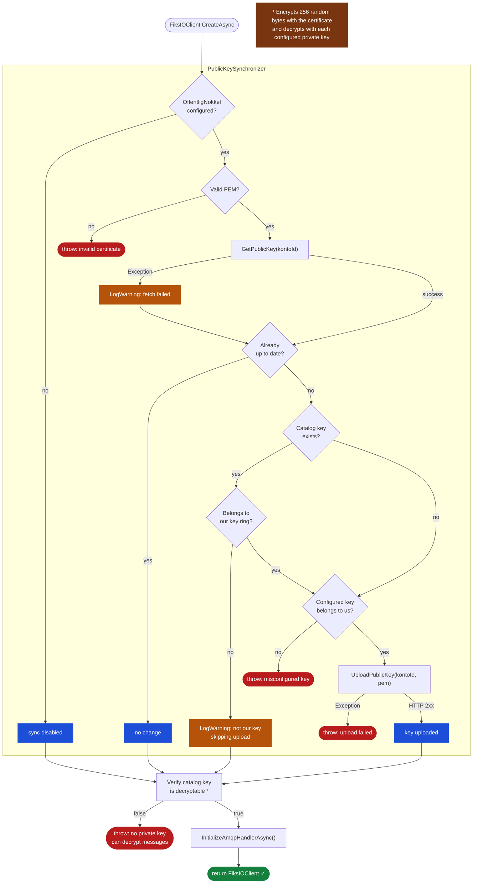

# Automatic Public Key Synchronization

## Background

Setting up a Fiks-IO account traditionally required a vendor and a municipality employee to coordinate manually: the vendor generates a key pair, sends the public key to the employee, who then uploads it via Fiks-konfigurasjon. Both parties had to be available at the same time.

With automatic public key synchronization, the client uploads the configured public key to the Fiks-IO catalog on startup — eliminating the need for manual coordination. The municipality employee can set up the account independently and share the account details with the vendor afterward. The first time the vendor starts their client, the key is registered automatically.

---

## Configuration

Pass the public certificate (PEM-encoded X.509) alongside the private key(s) in `KontoConfiguration`:

```csharp
// Single private key
FiksIOConfigurationBuilder
    .Init()
    .WithFiksKontoConfiguration(kontoId, privateKeyPem, publicCertPem)
    ...

// Multiple private keys (key rotation)
FiksIOConfigurationBuilder
    .Init()
    .WithFiksKontoConfiguration(kontoId, new[] { oldPrivateKeyPem, newPrivateKeyPem }, newPublicCertPem)
    ...
```

`OffentligNokkel` is optional. Omitting it disables the feature entirely (fully backward-compatible).

---

## How It Works

`FiksIOClient.CreateAsync` runs `PublicKeySynchronizer.SynchronizePublicKeyAsync` before initializing the AMQP connection. The synchronizer:

1. Skips immediately if `OffentligNokkel` is not configured
2. Fetches the current public key from the catalog
3. Compares it with the configured key (DER byte comparison)
4. Validates ownership before uploading (see scenarios below)
5. Uploads if needed, then proceeds with normal startup

After synchronization, `CreateAsync` verifies that the effective catalog key (the key now registered in the catalog) can be decrypted by at least one configured private key. If not, `CreateAsync` throws `InvalidOperationException` and the client does not start. Misconfiguration and catalog unavailability that prevents the key from being set up correctly are treated as fatal startup errors.

---

## Flow Diagram



---

## Scenarios

### Scenario 1 — First-time setup: no key in catalog

**Precondition:** A new account has been created. No public key has been registered yet.

**Flow:**
1. Catalog returns `null` for the account's public key
2. Synchronizer validates that `OffentligNokkel` matches one of the configured private keys — confirms the vendor owns the key
3. Uploads `OffentligNokkel` to the catalog
4. Client starts normally

**Result:** Key is registered. Subsequent senders will encrypt messages using this key.

**Logs:**
```
INFO  Uploading public key for account {KontoId}.
INFO  Public key uploaded for account {KontoId}.
```

---

### Scenario 2 — Key already current

**Precondition:** The public key in the catalog is identical to `OffentligNokkel`.

**Flow:**
1. Catalog returns the existing certificate
2. DER byte comparison shows keys are identical
3. No upload needed

**Result:** Nothing happens. Startup proceeds immediately.

**Logs:**
```
DEBUG Public key for account {KontoId} is already up to date, skipping upload.
```

---

### Scenario 3 — Key rotation: replacing our own old key

**Precondition:** The catalog has an existing public key that belongs to the vendor's key ring (the matching private key is still configured). The vendor has generated a new key pair and wants to rotate.

**Configuration:**
```csharp
.WithFiksKontoConfiguration(
    kontoId,
    privateKeys: new[] { oldPrivateKeyPem, newPrivateKeyPem },
    offentligNokkel: newPublicCertPem)
```

**Flow:**
1. Catalog returns the old certificate
2. Keys differ → upload candidate
3. Synchronizer validates the **catalog cert** against the private key ring → `oldPrivateKeyPem` matches → rotation authorized
4. Synchronizer validates `OffentligNokkel` against the private key ring → `newPrivateKeyPem` matches → new key is ours
5. Uploads the new public certificate

**Message decryption during rotation:**

Messages already on the queue were encrypted with the old public key. The AMQP consumer tries each private key in order until one succeeds:

```
Old message arrives (encrypted with oldPubCert)
  → try newPrivateKey → fails
  → try oldPrivateKey → succeeds ✅

New message arrives (encrypted with newPubCert)
  → try newPrivateKey → succeeds ✅
```

**When is it safe to remove the old private key?**

When you are confident the queue no longer contains messages encrypted with the old key. There is no built-in indicator for this — it is an operational decision. A conservative approach is to wait 24–48 hours after rotation before removing the old key from the configuration.

**Logs:**
```
INFO  Uploading public key for account {KontoId}.
INFO  Public key uploaded for account {KontoId}.
```

---

### Scenario 4 — Catalog has an unrelated key

**Precondition:** The catalog contains a public key that does not match any of the vendor's private keys. This would occur if the account was set up by someone else (e.g., the municipality uploaded a key manually).

**Flow:**
1. Catalog returns a certificate
2. Keys differ → upload candidate
3. Synchronizer validates the **catalog cert** against the private key ring → no match → rotation not authorized
4. Upload skipped
5. `CreateAsync` validates the catalog cert against the private key ring → no match → **throws `InvalidOperationException`**

**Result:** The client does not start. Messages in the queue are encrypted with a key the client cannot decrypt. The operator must either configure the matching private key or manually replace the catalog key.

**Logs:**
```
WARN  No configured private key matched the certificate for account {KontoId}.
WARN  Catalog public key for account {KontoId} does not belong to this client's key ring. Skipping upload.
ERROR [InvalidOperationException] No configured private key can decrypt messages for account {KontoId}.
```

---

### Scenario 5 — Misconfigured public key

**Precondition:** `OffentligNokkel` is set, but the certificate does not correspond to any of the configured private keys (e.g., wrong file was used).

**Flow:**
1. Catalog returns `null` (no existing key)
2. Synchronizer validates `OffentligNokkel` against the private key ring → no match
3. **Throws `InvalidOperationException`**

**Result:** The client does not start. The exception message clearly identifies the misconfiguration.

**Logs:**
```
WARN  No configured private key matched the certificate for account {KontoId}.
ERROR [InvalidOperationException] Configured public key for account {KontoId} does not match any configured private key.
```

---

### Scenario 6 — Catalog unavailable at startup

**Precondition:** The Fiks-IO catalog API is temporarily unreachable (network issue, maintenance).

**Flow:**
1. `GetPublicKey` throws an exception
2. Synchronizer logs a warning and attempts to upload anyway
3. `UploadPublicKey` also fails (catalog still unreachable) → exception propagates out of `CreateAsync`

**Result:** The client does not start. Catalog availability is required at startup to ensure the key registration state is known. Retry on the next restart.

**Logs:**
```
WARN  Failed to retrieve public key from catalog for account {KontoId}. Attempting upload.
ERROR [<catalog exception>] Upload failed for account {KontoId}.
```

---

### Scenario 7 — Feature not configured (backward-compatible)

**Precondition:** `WithFiksKontoConfiguration` is called without `offentligNokkel`.

```csharp
.WithFiksKontoConfiguration(kontoId, privateKeyPem)
```

**Flow:**
1. `OffentligNokkel` is `null`
2. Synchronizer exits immediately — no catalog call is made

**Result:** Behavior is identical to the client before this feature was introduced. No breaking change.

---

## Key Rotation Step-by-Step Guide

1. **Generate a new key pair** (e.g. with OpenSSL or a PKI tool)
2. **Update configuration** — add the new private key to the list and set the new public cert as `OffentligNokkel`. Keep the old private key in the list:
   ```csharp
   .WithFiksKontoConfiguration(
       kontoId,
       new[] { oldPrivateKeyPem, newPrivateKeyPem },
       newPublicCertPem)
   ```
3. **Deploy and restart** — the client uploads the new public key to the catalog on startup
4. **Wait** until you are confident the queue is drained of messages encrypted with the old key
5. **Remove the old private key** from the configuration and redeploy:
   ```csharp
   .WithFiksKontoConfiguration(kontoId, newPrivateKeyPem, newPublicCertPem)
   ```

---

## Known Limitations

- **No expiry awareness:** The synchronizer does not check certificate validity dates (`NotBefore`/`NotAfter`). An expired certificate in the catalog will not be replaced automatically unless the configured `OffentligNokkel` differs from it.
- **No rotation drain indicator:** There is no built-in signal for when it is safe to remove an old private key. This is left to the operator.
- **Sync is startup-only:** Synchronization runs once when the client is created. If the catalog key changes while the client is running, it will not be detected until the next restart.
